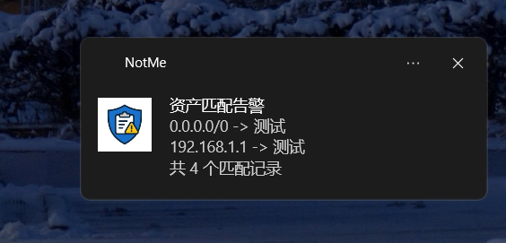

# NotMe

蓝队资产判断工具，资产判断提醒

## 使用
在Release中下载最新版本，通过修改`config.toml`来加载资产，配置作用如下
```toml
[[xlsx]]
# 文件位置
path = "example.xlsx"
# 表选择
sheet = "Sheet1"
# 资产列
col = "A"
# 资产信息列
desc = "G"
# xlsx密码，没有密码删除此项即可
pass = ""

[[xlsx]]
...

[[text]]
# 文本位置
path="example.txt"
# 分割符
delim=","

[[text]]
...
```
配置好后直接启动即可，任务栏会有标识。剪切板中如果出现加载过的资产会通过系统通知来进行提示。

